<!--
_backgroundColor: black
_footer: v0.0.01 - 05/10/2026 - CC BY-NC-SA
-->

# **Règlementation N1**

Alexandre Pierret
Stéphane Marques

---
<!--
_footer: '**FFESSM > Documents > En France > Dans le monde > Formation > Prérogatives > Quiz > Responsabilité > Mémo**'
-->
## Sommaire

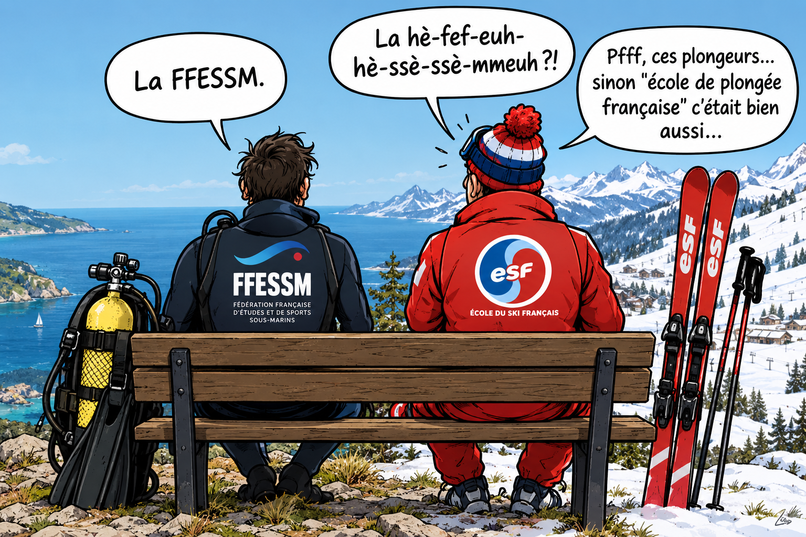

---
<!--
_backgroundColor: black
_footer: '**FFESSM** > Documents > En France > Dans le monde > Formation > Prérogatives > Quiz > Responsabilité > Mémo'
-->

# **La FFESSM**
*"Sortez le Doliprane"*

---
<!--
_footer: '**FFESSM** > Documents > En France > Dans le monde > Formation > Prérogatives > Quiz > Responsabilité > Mémo'
-->
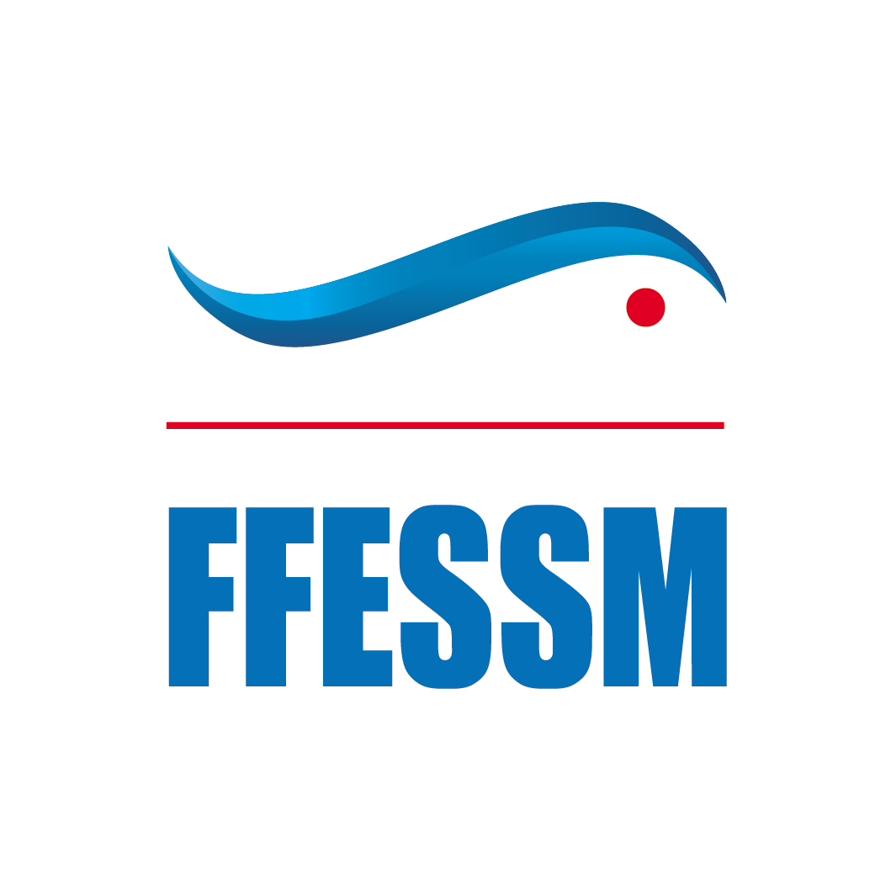
## La FFESSM

* **F**édération **F**rançaise d'**É**tudes et de **S**ports **S**ous-**M**arin
* Créée en 1955
* 15 commissions (technique scaphandre, apnée, ...)
* Président actuel: Frédéric Di Meglio
* Fédération sportive délégataire officielle

---
<!--
_footer: '**FFESSM** > Documents > En France > Dans le monde > Formation > Prérogatives > Quiz > Responsabilité > Mémo'
-->
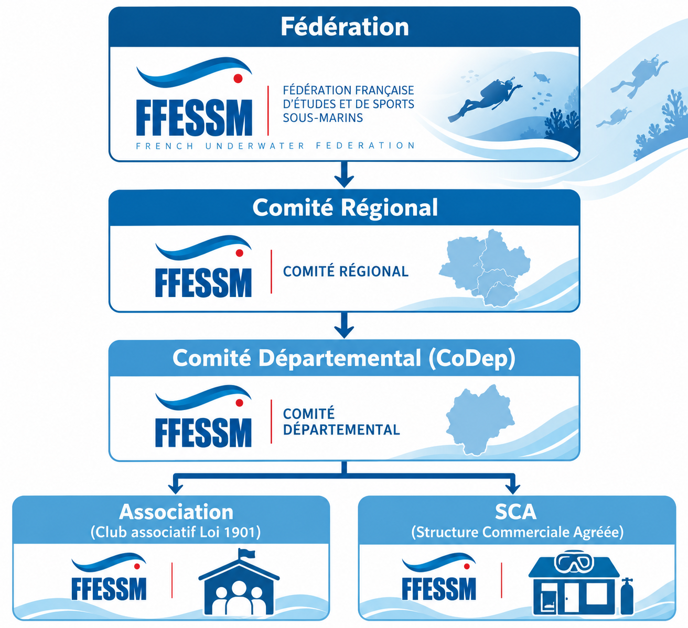
## FFESSM

* Organismes déconcentrés
* Pas de concurence entre associations et SCA
* Bénévolat important
* Élections en cascade

---
<!--
_backgroundColor: black
_footer: 'FFESSM > **Documents** > En France > Dans le monde > Formation > Prérogatives > Quiz > Responsabilité > Mémo'
-->

# **Les documents**
*"La phobie administrative"*

---
<!--
_footer: 'FFESSM > **Documents** > En France > Dans le monde > Formation > Prérogatives > Quiz > Responsabilité > Mémo'
-->
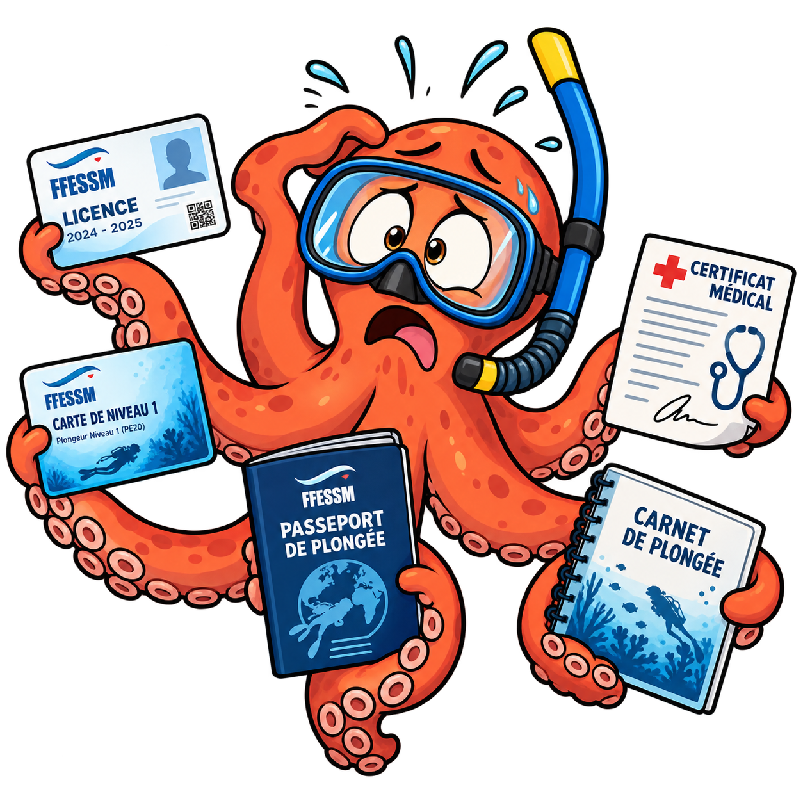

## Les 5 documents
- A présenter sur chaque site de plongée
    * La licence / assurance
    * CACI
    * La carte de niveau
* Passeport
* Carnet de plongée

---
<!--
_footer: 'FFESSM > **Documents** > En France > Dans le monde > Formation > Prérogatives > Quiz > Responsabilité > Mémo'
-->
## Document: La licence / assurance
- Valable du 01/09 au 31/12 de l'année suivante

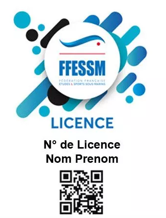 et/ou 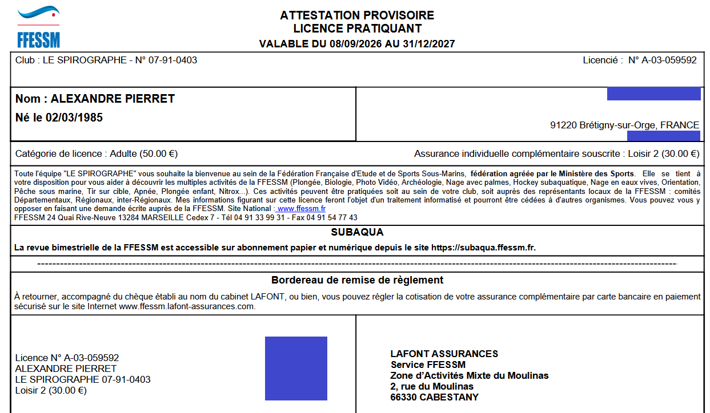
* La version papier fonctionne sans avoir besoin d'Internet 👍
---
<!--
_footer: 'FFESSM > **Documents** > En France > Dans le monde > Formation > Prérogatives > Quiz > Responsabilité > Mémo'
-->
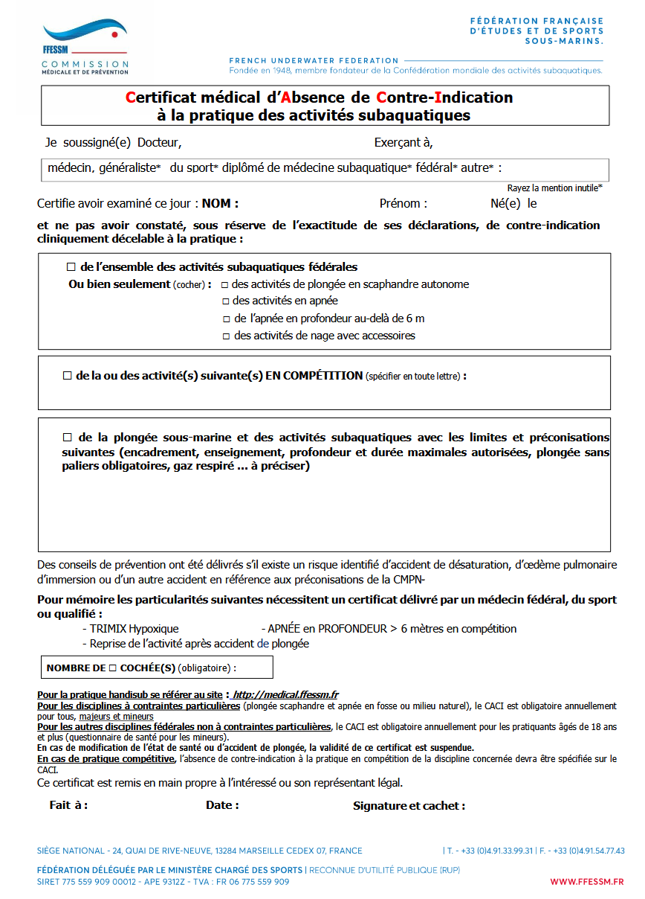

## Document: Le CACI
* **C**ertificat médical d'**A**bsence de **C**ontre-**I**ndication à la pratique des activités subaquatiques
* Valable 1 an
* Par tout médecin (sauf avis contraire)

---
<!--
_footer: 'FFESSM > **Documents** > En France > Dans le monde > Formation > Prérogatives > Quiz > Responsabilité > Mémo'
-->
## Document: La carte de niveau

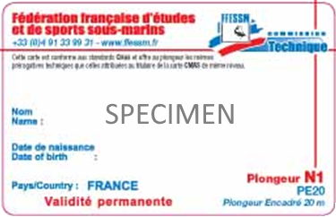 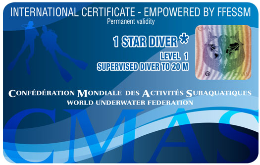
* Permet de justifier son niveau de plongeur auprès d'un club
* Double face (on verra plus tard pourquoi)
* Validité permanente

---
<!--
_footer: 'FFESSM > **Documents** > En France > Dans le monde > Formation > Prérogatives > Quiz > Responsabilité > Mémo'
-->
## Document: Le passeport
- Permet de consacrer la validation des compétences sur toute la vie d'un plongeur

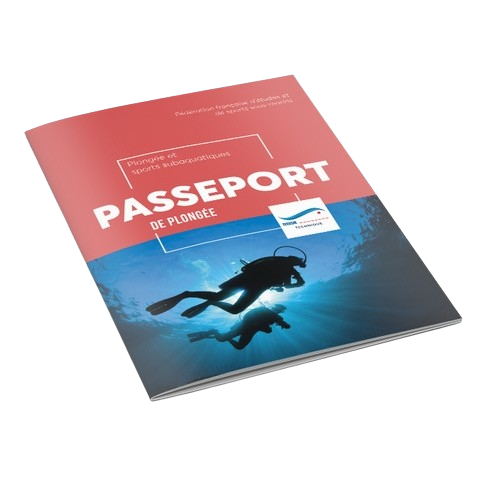 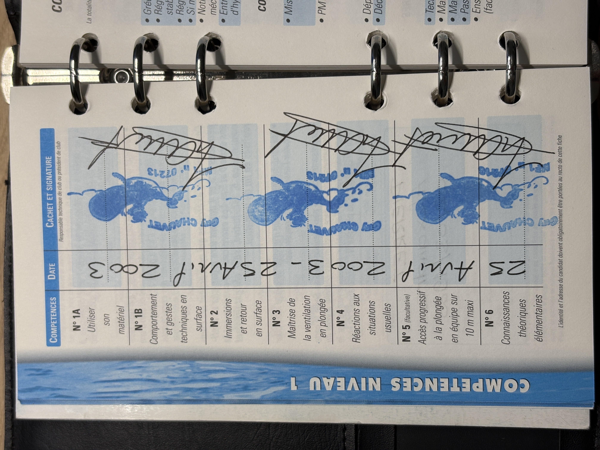

---
<!--
_footer: 'FFESSM > **Documents** > En France > Dans le monde > Formation > Prérogatives > Quiz > Responsabilité > Mémo'
-->
## Document: Le carnet de plongée
- Permet de consigner les plongées

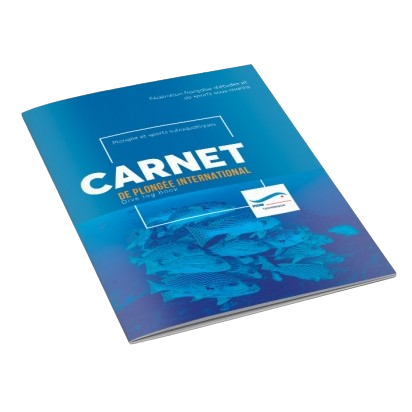 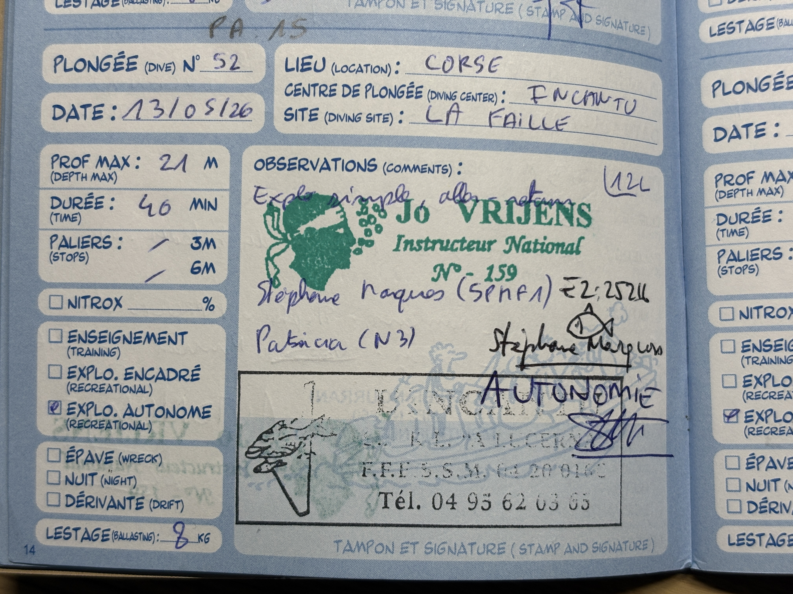

---
<!--
_backgroundColor: black
_footer: 'FFESSM > Documents > **En France** > Dans le monde > Formation > Prérogatives > Quiz > Responsabilité > Mémo'
-->

# **La règlementation en France**
*"Cocorico!"*

---
<!--
_footer: 'FFESSM > Documents > **En France** > Dans le monde > Formation > Prérogatives > Quiz > Responsabilité > Mémo'
-->
## En France, la plongée est libre, mais...
- Exclusion des garanties classiques
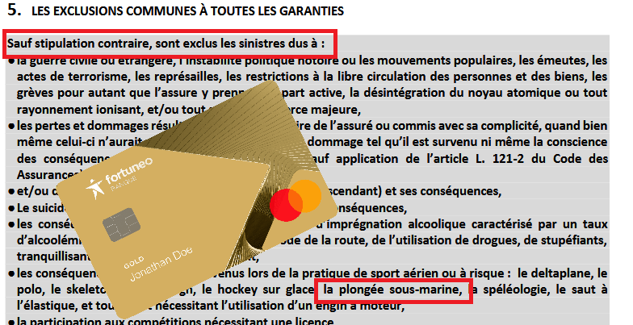

---
<!--
_footer: 'FFESSM > Documents > **En France** > Dans le monde > Formation > Prérogatives > Quiz > Responsabilité > Mémo'
-->
## Plonger en France
Les règles à respecter sont:
* Code du Sport (La loi)
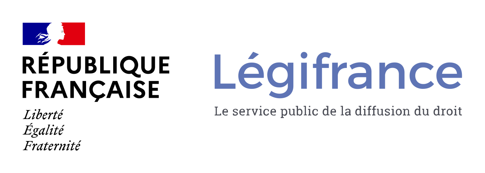
* Manuel de Formation Technique (MFT)
    - mft.ffessm.fr
* Règlements intérieurs (association, piscine, fosse, carrière, ...)
  - ex: bonnet de bain, détendeur eau froide, ...

---
<!--
_backgroundColor: black
_footer: 'FFESSM > Documents > En France > **Dans le monde** > Formation > Prérogatives > Quiz > Responsabilité > Mémo'

-->

# **La plongée à l'étranger**
*"J'aimerais bien découvrir ce petit rhum mexicain"*

---
<!--
_footer: 'FFESSM > Documents > En France > **Dans le monde** > Formation > Prérogatives > Quiz > Responsabilité > Mémo'
-->
## Plonger en dehors de la France (et au delà...)
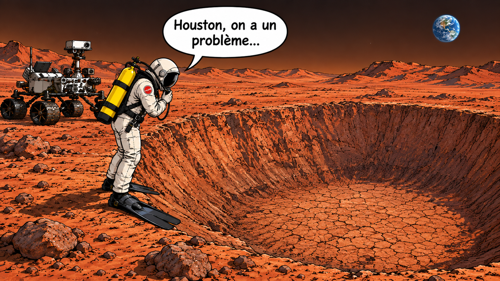

---
<!--
_footer: 'FFESSM > Documents > En France > **Dans le monde** > Formation > Prérogatives > Quiz > Responsabilité > Mémo'
-->
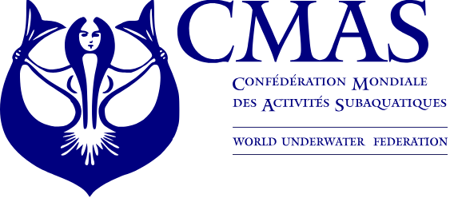
## CMAS

* **C**onfédération **M**ondiale des **A**ctivités **S**ubaquatiques
* Fondée par 15 fédérations autour de Jacques-Yves Cousteau en 1959
* Aujourd'hui plus de 100 pays
* Équivalence de niveaux entre chaque pays et la CMAS

---
<!--
_footer: 'FFESSM > Documents > En France > **Dans le monde** > Formation > Prérogatives > Quiz > Responsabilité > Mémo'
-->
## Plongée en dehors de France
Les règles à respecter sont comme en France:
* Législation locale
  - ex: 40m max en Espagne
* Manuel de Formation Technique (MFT) FFESSM dans le cadre d'une sortie club
* Règlementation spécifique du site (réserve naturelle, ...)
  - Ex: gants interdits quasiment partout en Egypte en Mer Rouge

---
<!--
_backgroundColor: black
_footer: 'FFESSM > Documents > En France > Dans le monde > **Formation** > Prérogatives > Quiz > Responsabilité > Mémo'
-->

# **La formation N1**
*"L'élevage des piou-piou"*

---
<!--
_footer: 'FFESSM > Documents > En France > Dans le monde > **Formation** > Prérogatives > Quiz > Responsabilité > Mémo'
-->
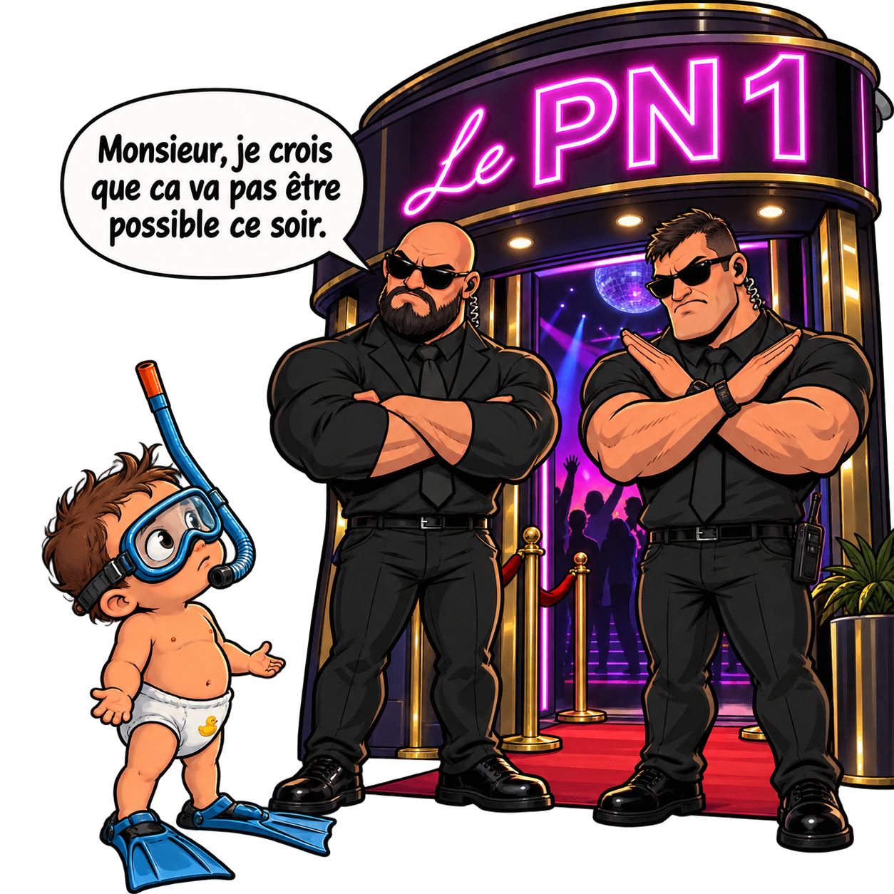
## Conditions d'accès à la formation "Prépa N1"
* 12 ans à la date d'entrée en formation
* Licence fédérale en cours de validité
* CACI en cours de validité

---
<!--
_footer: 'FFESSM > Documents > En France > Dans le monde > **Formation** > Prérogatives > Quiz > Responsabilité > Mémo'
-->
## Niveau 1 / PE20
Le brevet du Niveau 1 (FFESSM) est obtenu lorsque toutes les compétences (MFT) qui le compose sont validées sous 15 mois.
* Si N1 en piscine, 4 plongées en milieu naturel dans les 12 mois
* Plongeur Niveau 1 (FFESSM) == Plongeur PE20 (Code du Sport)
  - PE = **P**longeur **E**ncadrée (PA = **P**longeur **A**utonome)
  - 20 = profondeur maximum à 20m
* Et ensuite?
  * PE40 + PA20 = Niveau 2
  * PA60 = Niveau 3

---
<!--
_backgroundColor: black
_footer: 'FFESSM > Documents > En France > Dans le monde > Formation > **Prérogatives** > Quiz > Responsabilité > Mémo'
-->

# **Les prérogatives**
*"Mot compte triple"*

---
<!--
_footer: 'FFESSM > Documents > En France > Dans le monde > Formation > **Prérogatives** > Quiz > Responsabilité > Mémo'
-->
## Prérogatives du Niveau 1 (PE20)
"Avec mon PE20, je peux
  * plonger jusqu'à 20m,
  * dans une palanquée,
  * avec un guide de palanquée
  * et sous la responsabilité d'un directeur de plongée."

---
<!--
_footer: 'FFESSM > Documents > En France > Dans le monde > Formation > **Prérogatives** > Quiz > Responsabilité > Mémo'
-->
## Jusqu'à 20m (Code du Sport, c'est la Loi)
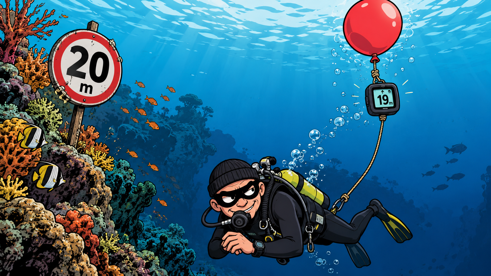

---
<!--
_footer: 'FFESSM > Documents > En France > Dans le monde > Formation > **Prérogatives** > Quiz > Responsabilité > Mémo'
-->
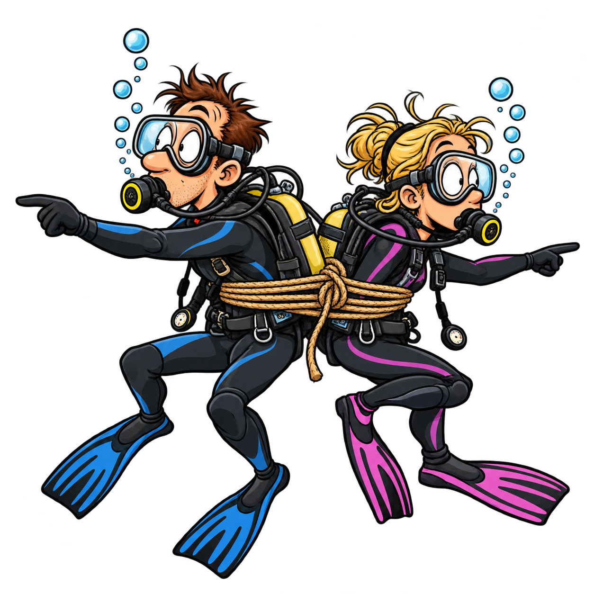
## La palanquée
* Groupe de plongeurs qui:
  * plongent ensemble et
  - suivent les mêmes caractéristique de:
    * durée
    * profondeur
    * trajet

---
<!--
_footer: 'FFESSM > Documents > En France > Dans le monde > Formation > **Prérogatives** > Quiz > Responsabilité > Mémo'
-->
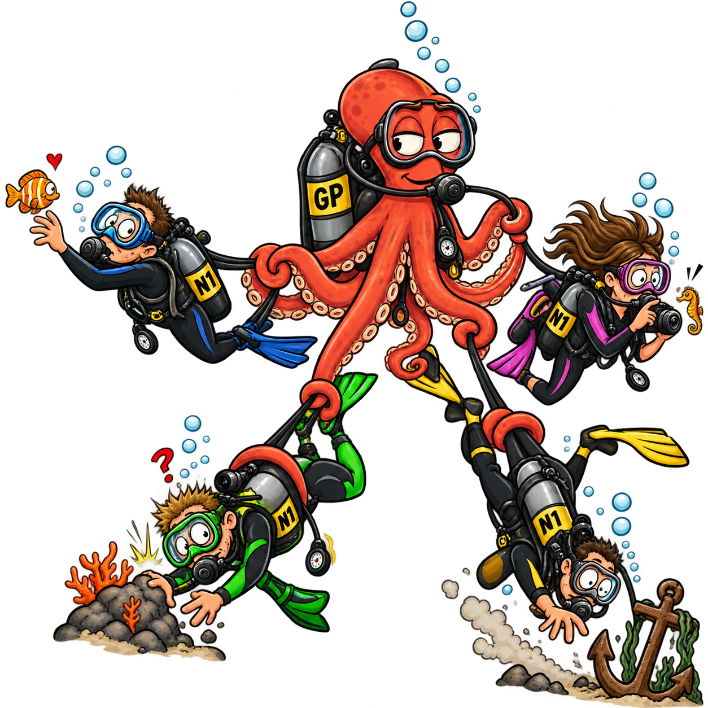

## Le Guide de Palanquée
- Alias: **GP**, Plongeur Niveau 4, GP-N4
* C'est celui qui conduit la palanquée
* Encadre jusqu'à 4 plongeurs en exploration
* Peut se joindre à une palanquée en serre-file

---
<!--
_footer: 'FFESSM > Documents > En France > Dans le monde > Formation > **Prérogatives** > Quiz > Responsabilité > Mémo'
-->
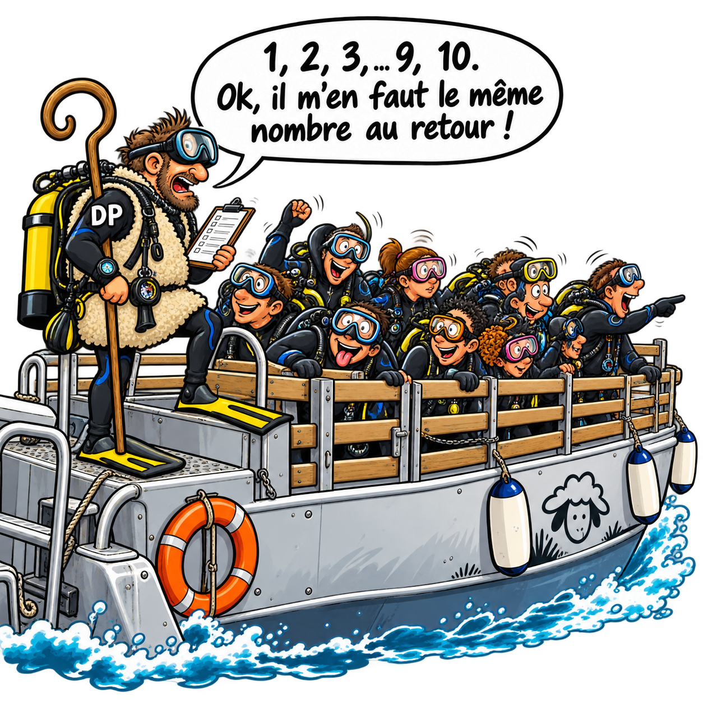

## Le Directeur de Plongée
* Alias: **DP**, "**D**ieu, le **P**ère"
* E3 (MF1), N5
* Choisi le site de plongée, organise et sécurise l'activité

---
<!--
_backgroundColor: black
_footer: 'FFESSM > Documents > En France > Dans le monde > Formation > Prérogatives > **Quiz** > Responsabilité > Mémo'
-->

# **Quiz**
*"Courage, c'est presque fini"*

---
<!--
_footer: 'FFESSM > Documents > En France > Dans le monde > Formation > Prérogatives > **Quiz** > Responsabilité > Mémo'
-->
## Quiz

*Mon pote Niveau 2 (**P**longeur **A**utonome, 40m), 500 plongées, permis bateau, RIFA-P, me propose de plonger en toute sécurité avec lui.*

* **Question:**

*Quelle sera la limite de profondeur de notre plongée?*

* **Réponse**:

Piège! Un N1 ne peut pas plonger seul avec un N2. Un N2, même avec 2000 plongées et un brevet de SuperMan, n'est pas un GP!

---
<!--
_footer: 'FFESSM > Documents > En France > Dans le monde > Formation > Prérogatives > **Quiz** > Responsabilité > Mémo'
-->
## Quiz
**Question**:

Quels sont les effectifs et la profondeur maximum d'une palanquée qui comporte au moins un Niveau 1.

---
<!--
_footer: 'FFESSM > Documents > En France > Dans le monde > Formation > Prérogatives > **Quiz** > Responsabilité > Mémo'
-->
## Quiz: réponse
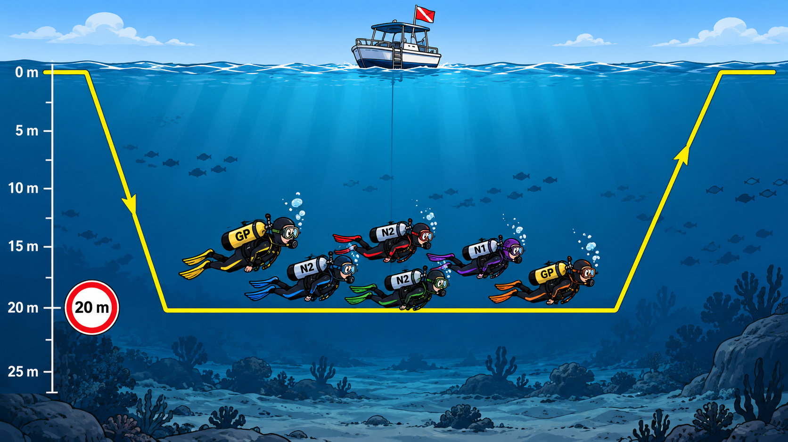

---
<!--
_backgroundColor: black
_footer: 'FFESSM > Documents > En France > Dans le monde > Formation > Prérogatives > **Quiz** > Responsabilité > Mémo'
-->

# **Les responsabilités du Plongeur Niveau 1**
*"Un grand pouvoir ..."*

Oncle Ben

---
<!--
_footer: 'FFESSM > Documents > En France > Dans le monde > Formation > Prérogatives > Quiz > **Responsabilité** > Mémo'
-->
# Responsabilités du N1
## "Savoir se comporter en palanquée"
* Connaitre ses prérogatives et ses limites
* Gérer son matériel et s'équiper
* Connaitre le vocabulaire, les signes de communication
* Se mettre à l'eau et sortir de l'eau
* Evoluer dans l'eau en respectant le milieu
* Respect des consignes de plongée et de sécurité du GP et du DP

---
<!--
_backgroundColor: black
_footer: 'FFESSM > Documents > En France > Dans le monde > Formation > Prérogatives > Quiz > Responsabilité > **Mémo**'
-->

# **Mémo**
*"Parce qu'on est quand même sympa"*

---
<!--
_footer: 'FFESSM > Documents > En France > Dans le monde > Formation > Prérogatives > Quiz > Responsabilité > **Mémo**'
-->
## Mémo / Ce qu'il faut retenir
- Le Niveau 1, c'est *"Savoir se comporter en palanquée"*
- Niveau 1 = **PE20** (**P**longeur **E**ncadré à 20m)
- Règlementation: Code du Sport + MFT + règlement(s) intérieur(s)
- Documents obligatoires: Licence / CACI / Niveau
- Palanquée: groupe de plongeurs qui plongent ensemble et suivent les mêmes caractéristiques de durée, profondeur et trajet
- Palanquée comportant un Niveau 1, c'est 4 plongeurs max, encadrés par un GP-N4

---
<!--
_backgroundColor: black
-->
# **MERCI**

---
<!--
_backgroundColor: black
-->
## **Crédits**
Plan et textes BIO, sans OGM, ni IA
Images générées avec OpenAI
Sous licence Creative Common (CC BY-NC-SA)
https://github.com/loiklo/ffessm_cours_theorie_n1
Plan: Alexandre Pierret (E1/A-03-059592) / Stéphane Marques (E2/A-17-774459)
Textes et prompts images: Alexandre Pierret
Relecture et correction: Nourrani Lignier (E4/A-05-246579)